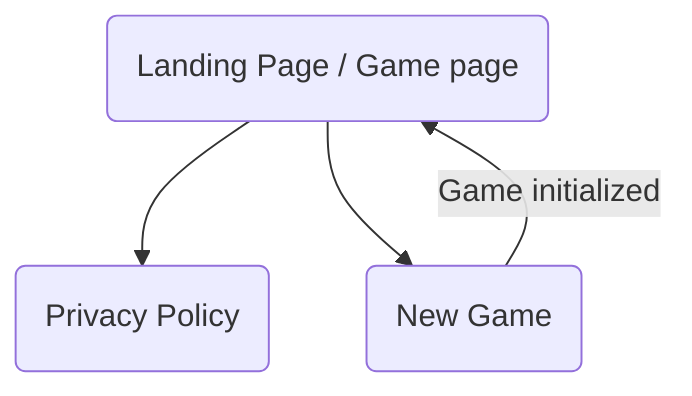

# WebTicTacToe

---

## Index

1. [Presentation](#presentation)
2. [Live Preview](#live-preview)
3. [Overview](#overview)
4. [Configuration](#configuration)
    1. [Requirements](#requirements)
    2. [Dependencies](#dependencies)
    3. [Installation](#installation)

---

## Live Preview

If you just wish to see the `live preview`, follow this link: [WebTicTacToe Live Preview](https://tictactoe.adebarbarin.com).

---

## Presentation

WebTicTacToe is a simple project aimed to learn `C#` language and `ASP.NET` framework implementing the famous TicTacToe game.

I used the `MVC model` to develop this simple web application.

---

## Overview

The web app is quite simple, here is a simple chart made with the [`mermaid` plugin](https://www.mermaidchart.com/):



---

## Configuration

### Requirements

- `.NET SDK v8.0.110` or later
- `ASP.NET Core v8.0.10` or later
- `.NET Core v8.0.10` or later

### Dependencies

- `Microsoft.AspNetCore.Session v2.2.0`

### Installation

- Download or clone this repository.
- From the root directory of the `YellowDirectory` project, type:
  ```Bash
    dotnet run
  ```
- The program must have been compiled, and executed.
- Now you can access the web app at: [`http://localhost:5050/`](http://localhost:5050/)