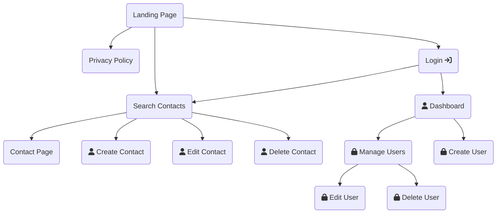

# Yellow Directory

---

## Index

1. [Presentation](#presentation)
2. [Overview](#overview)
3. [Configuration](#configuration)
   1. [Requirements](#requirements)
   2. [Dependencies](#dependencies)
   3. [Installation](#installation)

---

## Presentation

Yellow Directory is a project inspired by the French directory named `Pages Jaunes` in which businesses are recorded to browse and search for them by city or name to be able to retrieve their information, especially their phone number (originally).

This project is a simple application of this kind, showing basic information about some businesses, done in `C#` with `ASP.NET` framework and `Entity Framework` as a middleman between the web application and the database.

I used `PostgreSQL` as a `DBMS` because of its efficiency and flexibility with more complex types like lists, compared to `MySQL` or `MariaDB`.

---

## Overview

The web app is quite simple, here is a simple chart made with the [`mermaid` plugin <svg xmlns="http://www.w3.org/2000/svg" height="13" width="13" fill="grey" viewBox="0 0 512 512"><!--!Font Awesome Free 6.6.0 by @fontawesome - https://fontawesome.com License - https://fontawesome.com/license/free Copyright 2024 Fonticons, Inc.--><path d="M320 0c-17.7 0-32 14.3-32 32s14.3 32 32 32l82.7 0L201.4 265.4c-12.5 12.5-12.5 32.8 0 45.3s32.8 12.5 45.3 0L448 109.3l0 82.7c0 17.7 14.3 32 32 32s32-14.3 32-32l0-160c0-17.7-14.3-32-32-32L320 0zM80 32C35.8 32 0 67.8 0 112L0 432c0 44.2 35.8 80 80 80l320 0c44.2 0 80-35.8 80-80l0-112c0-17.7-14.3-32-32-32s-32 14.3-32 32l0 112c0 8.8-7.2 16-16 16L80 448c-8.8 0-16-7.2-16-16l0-320c0-8.8 7.2-16 16-16l112 0c17.7 0 32-14.3 32-32s-14.3-32-32-32L80 32z"/></svg>](https://www.mermaidchart.com/):



Visitors can only access four pages:
- Landing page
- Privacy policy
- Search contacts
- Contact

Users can access contact management pages:
- Create contact
- Edit contact
- Delete contact

The administrator can access user management pages:
- Manage users
- Edit user
- Delete user
- Create user

---

## Configuration

### Requirements

- `.NET SDK v8.0.110` or later
- `ASP.NET Core v8.0.10` or later
- `.NET Core v8.0.10` or later
- `PostgreSQL server v15.8` or later

### Dependencies

- `Microsoft.AspNetCore.Identity.EntityFrameworkCore v8.0.10`
- `Microsoft.EntityFrameworkCore.Design v9.0.0`
- `Microsoft.EntityFrameworkCore v9.0.0`
- `Npgsql.EntityFrameworkCore.PostgreSQL v9.0.0`
- `YamlDotNet v16.1.3` for debugging

### Installation

- Download or clone this repository.
- Create the database:
  - create a new database (`yellowdirectory` or what you prefer) in your `PostgreSQL server`;
  - create a user (`yellowdirectory` or the name you prefer) assigned to the database;
- Set the environment file:
  - copy the file `.env.example` and name it `.env`
    - fill it with the corresponding variables (example below):
      ```dotenv
        # DATABASE CONNECTION
        DB_HOST=localhost # address of the PostgreSQL server
        DB_PORT=5432
        DB_NAME=yellowdirectory # name of the database
        DB_USER=yellowdirectory # name of the user
        DB_PASSWORD=password # password of the user

        # CONTACT INSERTIONS (done when Contacts table is empty | JSON file must be in Data directory)
        JSON_DATA_FILE=mock-contacts.json

        # WEBSITE ADMINISTRATION (admin user created when it doesn't exist in the Users table)
        ADMIN_EMAIL=admin@yelldir.com
        ADMIN_PASSWORD=password # password of the admin user of the app
        ```
- From the root directory of the `YellowDirectory` project, type:
  ```Bash
    dotnet run
  ```
- The program must have been compiled, and executed. Before running the server, it automatically executes the migrations and adds the `admin` user if it doesn't exist in the database, so there might be issues if the previous steps were not executed properly.
- Now you can access the web app at: [`http://localhost:5050/`](http://localhost:5050/)